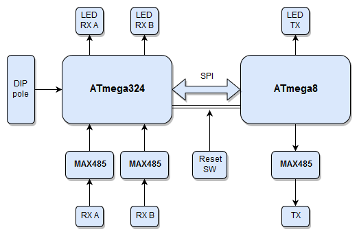

# dmx-merger

The practical part of my bachelor thesis, a device based on AVR microcontrollers, which joins two DMX512 signal streams together.

The project consists of 2 MCUs:
- `ATmega324P` that serves as a *receiver*, and "master" controller in the device, and
- `ATmega8` that serves as a *sender*, generating output DMX <u>signal</u>

More in [Bachelor thesis theory](BP_Timko_final2.pdf) (chapter 5), or in [presentation](BP_prezentacia.pdf).
 

  
  &nbsp; &nbsp; &nbsp; &nbsp; &nbsp; &nbsp; &nbsp; &nbsp;
   

